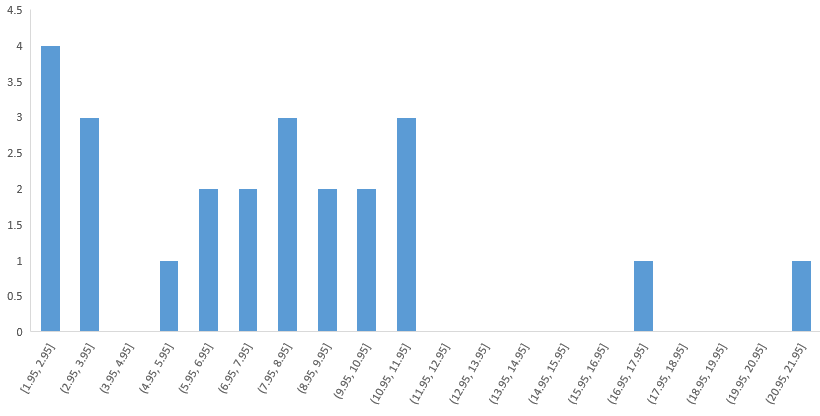

# 检测Stroop效应

## 自变量

文字条件的一致性。

## 因变量

人们说出同等大小的列表中的墨色名称的时间。

## 假设集

### 零假设

在一致文字条件和不一致文字条件下，人们说出同等大小的列表中的墨色名称的时间相等。
$$
H_0:\mu_{S}=\mu_D
$$
其中$\mu_S$表示文字条件一致时，人们说出说出同等大小的列表中的墨色名称的时间的总体均值；$\mu_D$表示文字条件不一致时，人们说出说出同等大小的列表中的墨色名称的时间的总体均值。

### 对立假设

在一致文字条件和不一致文字条件下，人们说出同等大小的列表中的墨色名称的时间不相等。
$$
H_A:\mu_{S}\neq\mu_D
$$

## 统计检验
前提：

- 自变量有文字条件一致和文字条件不一致两种。
- 因变量说出同等大小的列表中的墨色名称的时间是连续的。
- 各个参与者是相互独立的，因此因变量的差值也是相互独立的。
- 由于样本小于30，很难推断是否是正态分布。但因为因变量是人们的某种能力的对应指标，假设其呈正态分布。且根据样本数据看未严重违反。

选择：
- 样本少于30个，无法使用z检验。

- 知道总体的$\mu$及$\sigma$未知。

- 实验采用重复衡量设计，两个样本的数据来自于同一参与者，是两个相依样本。

  因此这里选择**配对t检验**。​

## 统计分析

差异的样本均值为
$$
\bar{X}=7.96
$$
中位数为：
$$
Median=7.67
$$

样本标准差：
$$
s=4.86
$$

## 可视化

下图为文字条件不一致时，样本中参与者说出同等大小的列表中的墨色名称的时间分布直方图：

可以看到，除了两侧各有2个较大的异常值外，其余数据呈现出正态分布的特征。

## 统计测试

差异的标准偏差：
$$
s=4.86
$$
t统计量：
$$
t_{STATICS}=\frac{\mu_D-\mu_A}{s/\sqrt{n}}=\frac{7.97}{0.99}=8.05
$$
在显著性水平$\alpha=0.05$时：
$$
t(23)=2.069
$$

$$
p<0.05,two-tailed
$$

置信区间：
$$
95\%CI=(5.91,10.01)
$$
根据以上数据计算结果，**拒绝零假设**。

## 结论

在一致文字条件和不一致文字条件下，人们说出同等大小的列表中的墨色名称的时间不相等。

这个结论与我的期望一致。

## 参考文献

- https://zh.wikipedia.org/wiki/斯特鲁普效应
- udacity.com DAND课程